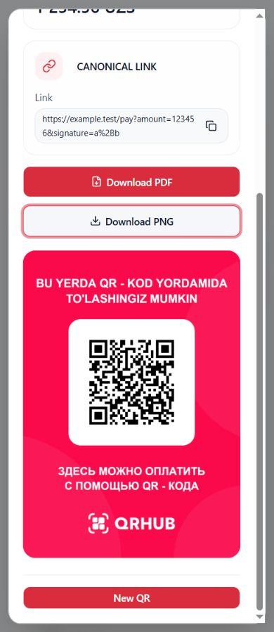

# I18N.4 — Dynamic QR localization

Implemented and verified on 2026-10-09. **Technical checkpoint COMPLETE.** Independent human translation/product approval and real-backend E2E are not claimed. I18N.5 has not started.

## Baseline and workspace preservation

Baseline commit: `b4d78b84fcb793ac3b99af2bb15180a6c07f6206`. Branch: `feature/dashboard-analytics`. The initial working tree was already dirty with I18N.0–I18N.3 implementation, tests, resources, reports and unrelated existing changes: 163 `git status --short` entries. No reset, stash, revert, commit, branch change or dependency upgrade was performed.

An initial SHA-256 inventory of tracked and nonignored untracked files was captured in ignored `i18n4-baseline.log`, together with the commit, branch and exact initial status. The incremental inventory below compares against that snapshot, rather than attributing the entire dirty Git diff to I18N.4. Earlier catalogs, reports and artifacts remain. `package.json`, `package-lock.json`, auth/session code, shared Money code, API/contracts, read runtime and business controllers have no incremental changes.

Source review included the architecture audit and text inventory, previous checkpoint reports, guarded i18n owner, Dynamic QR components, imported shared UI, read contracts, status classifier, create/cancel controllers, date/money helpers, export and poster helpers, and existing tests. Reused presentation components were treated according to their consumers rather than directory location.

## Text surfaces and ownership

| Class | Sources and ownership | Treatment |
| --- | --- | --- |
| A — Dynamic QR UI | Page, list/table columns, advanced/quick filters, stats, create/cancel, details, QR display, export/download feedback | Guarded `dynamicQr` messages; factories resolve labels on render |
| B — common UI | AsyncState, FilterDrawer, PaginationBar, table preferences, row-menu controls, close/apply/reset/cancel, refresh, ResultToast | Reuse existing guarded `common` presentation; no duplicate universal catalog |
| C — dashboard presentation | Dashboard-owned recent-QR labels and menu overrides; shared calendar presentation | Preserve dashboard namespace/overrides; extract the established calendar facade for reuse |
| D — API/domain values | Status and distribution codes, Money scale/currency, filter dates, permission gates, outcome kinds | Preserve values and finite verified classifiers |
| E — technical identifiers | Column IDs, scope/query keys, QR/terminal/merchant/bank IDs, RRN, raw status codes, route, filenames | Remain literal; never use as translation keys |
| F — backend strings | Merchant/terminal/bank names, opaque metadata, canonical link | Remain ordinary data, including strings resembling keys or interpolation tokens; arbitrary error reasons are not displayed |
| G — document content | Fixed Uzbek/Russian QR poster and backend-owned XLSX | Preserve composition, branding, dimensions, encoded link, bytes and filename policy; localize surrounding controls only |
| H — accessibility | Loading/list/pagination names, calendar dates/navigation, search/actions, dialog headings, copy/status announcements, QR alt/group/title, download names | Guarded feature/common labels; technical relationships remain stable |
| I — dev/test/preview | Synthetic review controls, scenario data, test-only transport/canvas stubs | Not production translations; temporary native-browser harness removed |

The migration covers direct JSX, passed labels, static column/option metadata, status descriptors and stateful feedback. Business controllers still expose their existing engine-independent outcomes/reasons. The presentation adapter classifies only an explicit whitelist of verified frontend reasons. Legacy `row-actions.ts` labels and the optional unported DateRangeQuickFilter default are retained for other consumers; the Dynamic QR page uses the localized menu and supplies the existing calendar presentation port.

## Namespace and resources

Activated only `dynamicQr` through `src/shared/i18n/namespaces.json` and the bundled resource owner. Added complete Uzbek, Russian and English catalogs: **155 logical keys per locale**, 465 physical translation leaves total. There are no plural variants in this namespace. Whole count/bounds/ID/outcome templates use named parameters; numeric total presentation is formatted before interpolation.

Canonical Uzbek and matching Russian/English resources were authored first; `npm run locales:generate` produced declarations and interpolation metadata. Generated files were never hand-edited. Catalog parity, approved namespaces, placeholder types, freshness and the AST import boundary pass. Components do not import i18next or translation JSON, and there is no module-evaluation translation call or uncontrolled backend-key construction.

| Group | Keys |
| --- | ---: |
| page | 12 |
| stats | 4 |
| filters | 21 |
| status | 7 |
| distribution | 3 |
| table | 11 |
| actions | 3 |
| create | 28 |
| validation | 1 |
| cancel | 12 |
| details | 17 |
| display | 9 |
| download | 5 |
| export | 7 |
| feedback | 11 |
| dates | 4 |

The complete logical-key inventory is appended below. Negative planned-namespace tests now use the still-disabled `staticQr` namespace.

## Production modules and shared effects

**24 production TypeScript/TSX modules** changed or added, plus **2 namespace/resource registration files**. These comprise 22 Dynamic QR modules, the shared calendar facade, and its existing dashboard caller. Catalogs and generated declarations/metadata are counted separately in the file inventory.

`createDynamicQrPresentation` provides typed guarded messages, finite status labels, semantic feedback, registry-selected number/date formatting and the shared calendar port. `createDynamicQrColumns` replaces static translated column labels while retaining IDs, order, visibility metadata, render semantics and persistence keys. Components recompute presentation through the current LocaleProvider without keying business components by locale.

`src/shared/presentation/calendar.ts` extracts the I18N.3 date/month/weekday/wall-time facade. Dashboard presentation delegates to it; dashboard behavior remains covered by the full suite. UTC calendar carriers, explicit Uzbek numeric dates and Monday-first headings are retained. DateRangeQuickFilter's existing optional presentation port and its calendar algorithms were not changed in this checkpoint.

QR display/copy/poster/download components and DynamicQrActionsMenu have existing dashboard, static QR or terminal consumers. Their shared interactive labels now react to the selected language. Dashboard-supplied menu overrides remain authoritative. Static QR/terminal parent-owned metadata and domain status presentation remain in their existing checkpoint scope; this work does not activate or migrate their namespaces. Full tests cover these consumers. Poster content does not inherit the UI locale.

## List, status, filters, dates and statistics

List headings, loading/empty/error/stale states, summary labels, columns, pagination context, toolbar/search, advanced filters, row actions and accessibility are localized. Existing IDs, nullable data, pagination and saved column preferences remain stable. An integration test exercises a hidden column, its persisted value, retained checkbox DOM/focus, unchanged applied filters/page and actual request counts.

Verified raw QR status classification remains: `0 → new`, `5 → expired`, `10 → processing`, `20 → cancelled`, `25 → rejected`, `50 → success`; other values remain unknown. Translated labels follow the existing classifier and retain its tones. Status filter values/order remain `['', '0', '10', '50', '5', '20', '25']`; distribution filter values remain their original contract values. Eligibility and success decisions never inspect translated text.

**The actual current default is one day**, from `createDefaultDynamicQrFilters` calling `getTashkentDatePreset(1)`. No one-month default exists in the inspected source. Initialization and reset preserve that product value. Draft/applied date and terminal/search lifecycles, ISO wire dates, range boundaries, calendar navigation, Asia/Tashkent calculation and page resets remain unchanged. Visible English numeric dates use the registry's English ordering; offsetless timestamps retain their original wall-clock `HH:mm`, without timezone conversion. Refresh instant presentation uses the selected registry locale with Asia/Tashkent explicitly.

Statistics still use **GET `/dynamic-qrs/stats`**, the original feature flag/date/terminal gates, query parameters, cache keys, refresh and mutation invalidation. Total amount and service fee keep exact shared Money rendering. Failed/unavailable statistics display feedback rather than fabricated zero values. Locale switching does not trigger statistics/list/lookup reads.

## Create and cancellation safety

Create labels, lookups, amount help/bounds/validation, pending notice, confirmed/rejected/not-sent/unknown result and new-intent guidance are localized. The raw MoneyInput draft is never translated or reformatted on a locale change. Tests preserve `1 234,56`, selected raw terminal ID, input DOM, focus and caret, then assert the original `{ terminalId, amount: 123456, currencyCode: 'UZS' }` payload and exactly one dispatch across in-flight switching. BigInt parsing, accepted grammar, bounds, safe-integer conversion, ports, controller identity, request correlation/idempotency behavior and invalidation remain unchanged. Confirmed payment links and QR identities remain exact data.

Cancellation heading, warning and confirm caption use `critical(...)`. All three must resolve through the established requested-locale/canonical guard. If essential canonical copy is unavailable, the UI shows independent emergency recovery copy and a safe close action, with no confirm control. The click handler also rechecks essential resolution before dispatch. Three missing-critical-key tests prove blocked dispatch; ordinary fallback/interpolation tests prove key non-leakage.

**Production cancellation remains unavailable under the existing gate**: the live controller adapter supplies no port and no eligible row. No endpoint, authorization, eligibility or destructive affordance was enabled. Native review uses an explicitly synthetic eligible controller. Real-controller unit tests exercise open confirmation copy/focus, controlled pending content, one dispatch, and an unknown outcome that prevents a fresh intent until status recheck. Existing production confirmation closure at dispatch and controller transitions remain unchanged; no new pending-modal lifecycle is claimed. Confirmed, rejected, not-sent and unknown remain distinct; unknown warns that the request may have reached the server and that retry safety is unconfirmed.

## Semantic feedback, details and QR display

Copy feedback stores `copied`/`failed`; filter feedback stores `invalid`; export feedback stores `unavailable`/`success`/`failed`; create action feedback stores a finite typed outcome. These are resolved at render time, including after asynchronous completion, so a mounted notification updates to the current language. Export toast identity remains keyed by semantic outcome rather than translated title, preserving its existing lifetime/placement. Controller reason strings stay internal and engine-independent.

The presentation whitelist distinguishes permission, selection, unavailable, already-sent, unknown and generic not-sent feedback. An already-dispatched request is not relabeled as an ordinary input failure. Unrecognized/private backend reason strings receive approved generic frontend wording and cannot become translation keys.

Details/display dialogs retain selected rows and open state across locale switching. Raw QR ID/RRN/terminal IDs, metadata, links and technical codes remain literal. Real rendered clipboard tests verify exact ID/link copy and reactive completed feedback. The huge amount `900719925474099301` minor units still renders **`9 007 199 254 740 993.01 UZS`**, without Number conversion or precision loss.

## PNG/PDF and XLSX boundaries

Surrounding poster generation/loading/error, PNG/PDF buttons and accessible descriptions are localized. `qr-poster.ts` composition and `qr-poster-download.ts` output code are unchanged. The poster stays **1240 × 1754**, fixed bilingual Uzbek/Russian, with existing branding, QR link and filename sanitization. Native browser review used the real QR/canvas renderer and showed the complete bilingual poster under English UI. The generation effect is keyed by the original link and existing ready callback, not locale. Future poster-language policy is a separate product decision.

XLSX export retains the protected bridge, request query, blob/byte handling, Content-Disposition filename/fallback, filter/scope intent key, stop-waiting behavior and below-header notification placement. Locale is not added to the request. Backend column headings remain backend-owned. The pending test verifies one request and one handoff, unchanged byte buffer and filename, Russian completion feedback followed by English feedback on the same mounted notification. Native review exercised pending/failure UI; no real XLSX backend download is claimed.

## Accessibility and test inventory

Guarded labels cover list/loading/pagination, search/clear/apply, calendar navigation/full dates, menu controls, dialogs and fields, copy/download titles, QR descriptions, poster alt/group text and live feedback. The fixed bilingual poster's visually hidden text keeps explicit `lang="uz"` and `lang="ru"`. Technical IDs and label/control relationships are retained.

New `dynamic-qr.i18n.test.tsx`: **16 tests**, with real isolated locale runtimes, React StrictMode, actual components, QueryClient and real action controllers. Coverage includes six UZ/RU/EN table/filter/status/date tests, raw backend-looking identifiers, create draft/caret/pending exact payload, cancellation focus/single dispatch/unknown outcome, three critical-copy corruptions, ordinary missing-copy/interpolation safety, semantic already-sent distinction, open details/copy, QR display/poster boundary and pending XLSX query/bytes/filename/current-language feedback. DOM-only canvas and transport boundaries are stubbed; binary/poster helper tests remain real.

New `dynamic-qr.locale-queries.test.tsx`: **1 integration test**, with actual AuthProvider, read runtime, QueryClient, DynamicQrPage and a fake device-lock manager. It asserts unchanged auth/token/session, route, query/cache object/data identities, applied dates/page, open unfinished calendar/day identity, hidden-column persistence/focus and settled list/statistics/lookup request counts across language changes.

Existing affected tests use the established isolated locale fixture, typed column factory and localized visible-date assertions while retaining technical wire values, amount/grammar, callback and lifecycle assertions. No tests were skipped, timeout increased, dependency changed, or lint/type suppression introduced. Earlier fixture failures were corrected; final passing runs below supersede them. The full suite also verifies previous checkpoints and shared consumers.

## Exact verification results

Commands ran against the combined dirty I18N.0–I18N.4 workspace, after final production/test changes. Every command below exited 0.

| Command | Final result |
| --- | --- |
| `npm run locales:generate` | PASS; generated canonical declarations/metadata |
| `npm run locales:validate` | PASS; UZ/RU/EN integrity for common, shell, auth, account, dashboard and dynamicQr |
| `npm run lint` | PASS; AST i18n boundary; two existing Fast Refresh warnings, button.tsx:66 and badge.tsx:48 |
| `npm run typecheck` | PASS; catalog validation and `tsc -b --pretty false` |
| `npx vitest run src/features/dynamic-qr src/shared/money` | PASS; **47 files, 344 tests**, 10.26 seconds |
| `npm test` | PASS; **219 files, 2,060 tests**, 64.50 seconds |
| `npm run build` | PASS; catalog/boundary/TypeScript and Vite 8.3.0; **3,814 modules**, Vite phase 1.61 seconds |
| `git diff --check` | PASS; no whitespace errors; Windows LF/CRLF normalization notices are informational |

The pre-existing large-chunk build warning remains (PlotRenderers about 1.46 MB minified, main about 530 kB). No unrelated bundling work was performed. Ignored `i18n4-*.log` transcripts retain command output and the initial hash snapshot; they are not production artifacts.

## Actual browser verification

The Codex in-app browser rendered the actual components through a temporary localhost harness with synthetic reads/profile and create/cancel/export ports. The real browser QR/canvas/poster renderer was used. Viewports: **390 × 900 mobile** and **1280 × 900 desktop**. UZ/RU/EN and light/dark layouts were reviewed. The harness, agent-created tab and development server were removed/closed after review; the viewport override was reset.

| Reviewed scenario | Evidence / limit |
| --- | --- |
| UZ desktop/mobile and RU/EN desktop toolbar, summary, table, unknown status, pagination | Native screenshots; horizontal table scroll retains existing layout |
| RU dark desktop and RU dark mobile calendar; RU light desktop two-month calendar | Monday-first localized names/navigation; mobile calendar fits |
| RU desktop create draft → EN; EN mobile create/result; RU mobile open create | Raw draft/terminal survive switching; synthetic confirmed result; Russian title/footer wrapping fits |
| Real native QR poster under EN UI | Fixed Uzbek/Russian content and download controls visible; no physical PNG/PDF file download in this native pass |
| RU mobile advanced filters → EN with selected terminal draft | Open drawer and literal backend name retained |
| EN mobile row menu opened with keyboard; details panel | Localized actions/fields, literal ID, exact huge amount and offsetless time |
| RU mobile synthetic cancellation confirmation → EN | Same open sheet, translated warning/footer; dismissed without a native cancellation dispatch |
| EN mobile XLSX pending/failure | Current notification placement and wrapping fit; bytes/success/filename verified in unit tests |
| EN empty state | Actual synthetic empty page inspected; broader loading/error matrix covered by automated/shared tests |

The screenshots include a clearly marked synthetic review toolbar, which is not product UI. Mobile geometry checks showed the dialog within the viewport and document width equal to the viewport. The existing narrow fixed table amount cell can visually clip unusually large values; full exact values remain in the DOM, summary and details, and formatting precision is unchanged. This pre-existing table layout constraint is recorded rather than silently changing financial rendering/layout.

**NOT_RUN:** production-backend authenticated create/cancel/XLSX E2E, physical PNG/PDF/XLSX downloads in this native review, external QR scanner/payment validation, real screen-reader audit, 200% browser zoom, exhaustive state × language × theme × viewport matrix, native controlled-pending cancellation locale switch, and initial-load list/statistics transport-error visual inspection. Pending/error/unknown and download-byte behavior have automated coverage; this is not a substitute claim for these native scenarios.

## Translation review, risks and I18N.5 readiness

All 155 triplets are authored and statically reviewed for parity, wording and outcome meaning. **Independent Uzbek/Russian/English native-speaker and human product approval is PENDING.** Technical completion is separate from that release approval. No assertion of external human approval or production-backend verification is made.

Remaining risks are the explicit unverified scenarios above, existing narrow table rendering for extreme values, inherited Fast Refresh/large-chunk warnings and the existing unavailable live cancel integration. Unmigrated static QR/management parent-owned copy remains for I18N.5. The fixed poster language and backend XLSX language policies require separate product decisions if changed later.

The enabled namespace and guarded shared facade are ready for a bounded I18N.5 follow-up. `staticQr`, `terminals`, `bankAccounts`, `cashiers` and `p5` remain planned/disabled. **I18N.5 — Static QR & Management Localization was not begun.**

## Incremental file inventory

SHA-256 comparison: **64 files** changed/added in this checkpoint: 26 production code/registration files, 14 test/type-test files, 3 catalogs, 2 generated files, 18 screenshots and this report. No baseline file disappeared. Protected business/shared paths listed above are byte-identical to the initial snapshot.

- `docs/i18n/I18N_4_DYNAMIC_QR_REPORT.md`
- `docs/i18n/screenshots/I18N_4_desktop_en_create_draft.png`
- `docs/i18n/screenshots/I18N_4_desktop_en_dark.png`
- `docs/i18n/screenshots/I18N_4_desktop_ru_calendar.png`
- `docs/i18n/screenshots/I18N_4_desktop_ru_dark.png`
- `docs/i18n/screenshots/I18N_4_desktop_uz.png`
- `docs/i18n/screenshots/I18N_4_mobile_en_cancel.png`
- `docs/i18n/screenshots/I18N_4_mobile_en_create.png`
- `docs/i18n/screenshots/I18N_4_mobile_en_details.png`
- `docs/i18n/screenshots/I18N_4_mobile_en_filter_draft.png`
- `docs/i18n/screenshots/I18N_4_mobile_en_menu.png`
- `docs/i18n/screenshots/I18N_4_mobile_en_poster.png`
- `docs/i18n/screenshots/I18N_4_mobile_en_result.png`
- `docs/i18n/screenshots/I18N_4_mobile_en_xlsx_feedback.png`
- `docs/i18n/screenshots/I18N_4_mobile_ru_calendar_dark.png`
- `docs/i18n/screenshots/I18N_4_mobile_ru_cancel.png`
- `docs/i18n/screenshots/I18N_4_mobile_ru_create.png`
- `docs/i18n/screenshots/I18N_4_mobile_ru_filters.png`
- `docs/i18n/screenshots/I18N_4_mobile_uz.png`
- `src/features/dashboard/presentation.ts`
- `src/features/dashboard/recent-qr.test.tsx`
- `src/features/dynamic-qr/BrandedQrPoster.tsx`
- `src/features/dynamic-qr/CancelQrConfirmation.test.tsx`
- `src/features/dynamic-qr/CancelQrConfirmation.tsx`
- `src/features/dynamic-qr/CanonicalLinkCard.tsx`
- `src/features/dynamic-qr/CreateQrContent.tsx`
- `src/features/dynamic-qr/CreateQrDialog.tsx`
- `src/features/dynamic-qr/CreateQrResult.tsx`
- `src/features/dynamic-qr/DateRangeQuickFilter.lifecycle.test.tsx`
- `src/features/dynamic-qr/DateRangeQuickFilter.test.tsx`
- `src/features/dynamic-qr/DynamicQrActionsMenu.tsx`
- `src/features/dynamic-qr/DynamicQrAdvancedFilterFields.tsx`
- `src/features/dynamic-qr/DynamicQrDetailsSheet.tsx`
- `src/features/dynamic-qr/DynamicQrPage.tsx`
- `src/features/dynamic-qr/DynamicQrQuickFilters.test.tsx`
- `src/features/dynamic-qr/DynamicQrQuickFilters.tsx`
- `src/features/dynamic-qr/DynamicQrTable.tsx`
- `src/features/dynamic-qr/ExportButton.tsx`
- `src/features/dynamic-qr/ExportQrPage.tsx`
- `src/features/dynamic-qr/PaymentQrCode.tsx`
- `src/features/dynamic-qr/QrDetailsCard.tsx`
- `src/features/dynamic-qr/QrDisplayDialog.tsx`
- `src/features/dynamic-qr/QrDisplayShell.test.tsx`
- `src/features/dynamic-qr/QrDisplayShell.tsx`
- `src/features/dynamic-qr/QrPosterDownloads.test.tsx`
- `src/features/dynamic-qr/QrPosterDownloads.tsx`
- `src/features/dynamic-qr/columns.test.ts`
- `src/features/dynamic-qr/columns.tsx`
- `src/features/dynamic-qr/create-composition.test.tsx`
- `src/features/dynamic-qr/dynamic-qr.i18n.test.tsx`
- `src/features/dynamic-qr/dynamic-qr.locale-queries.test.tsx`
- `src/features/dynamic-qr/feedback.ts`
- `src/features/dynamic-qr/filter-lookups.test.tsx`
- `src/features/dynamic-qr/presentation.ts`
- `src/locales/en/dynamicQr.json`
- `src/locales/ru/dynamicQr.json`
- `src/locales/uz/dynamicQr.json`
- `src/shared/i18n/catalog-validation.test.ts`
- `src/shared/i18n/generated.d.ts`
- `src/shared/i18n/messages.typecheck.ts`
- `src/shared/i18n/metadata.generated.ts`
- `src/shared/i18n/namespaces.json`
- `src/shared/i18n/resources.ts`
- `src/shared/presentation/calendar.ts`

### Screenshot evidence

- [I18N_4_desktop_en_create_draft.png](screenshots/I18N_4_desktop_en_create_draft.png)
- [I18N_4_desktop_en_dark.png](screenshots/I18N_4_desktop_en_dark.png)
- [I18N_4_desktop_ru_calendar.png](screenshots/I18N_4_desktop_ru_calendar.png)
- [I18N_4_desktop_ru_dark.png](screenshots/I18N_4_desktop_ru_dark.png)
- [I18N_4_desktop_uz.png](screenshots/I18N_4_desktop_uz.png)
- [I18N_4_mobile_en_cancel.png](screenshots/I18N_4_mobile_en_cancel.png)
- [I18N_4_mobile_en_create.png](screenshots/I18N_4_mobile_en_create.png)
- [I18N_4_mobile_en_details.png](screenshots/I18N_4_mobile_en_details.png)
- [I18N_4_mobile_en_filter_draft.png](screenshots/I18N_4_mobile_en_filter_draft.png)
- [I18N_4_mobile_en_menu.png](screenshots/I18N_4_mobile_en_menu.png)
- [I18N_4_mobile_en_poster.png](screenshots/I18N_4_mobile_en_poster.png)
- [I18N_4_mobile_en_result.png](screenshots/I18N_4_mobile_en_result.png)
- [I18N_4_mobile_en_xlsx_feedback.png](screenshots/I18N_4_mobile_en_xlsx_feedback.png)
- [I18N_4_mobile_ru_calendar_dark.png](screenshots/I18N_4_mobile_ru_calendar_dark.png)
- [I18N_4_mobile_ru_cancel.png](screenshots/I18N_4_mobile_ru_cancel.png)
- [I18N_4_mobile_ru_create.png](screenshots/I18N_4_mobile_ru_create.png)
- [I18N_4_mobile_ru_filters.png](screenshots/I18N_4_mobile_ru_filters.png)
- [I18N_4_mobile_uz.png](screenshots/I18N_4_mobile_uz.png)

## Complete Dynamic QR key inventory

- **page:** `page.name`, `page.loading`, `page.list`, `page.pages`, `page.integration`, `page.noAccess`, `page.emptyHigh`, `page.firstHelp`, `page.first`, `page.empty`, `page.stale`, `page.total`
- **stats:** `stats.total`, `stats.fee`, `stats.unavailable`, `stats.failed`
- **filters:** `filters.invalid`, `filters.checking`, `filters.unavailable`, `filters.noExpansion`, `filters.clear`, `filters.checkOrClear`, `filters.search`, `filters.searchShort`, `filters.clearSearch`, `filters.applySearch`, `filters.allMerchants`, `filters.noMerchants`, `filters.merchantsFailed`, `filters.allBanks`, `filters.noBanks`, `filters.noMerchantBanks`, `filters.banksFailed`, `filters.allTerminals`, `filters.clearSelection`, `filters.distribution`, `filters.all`
- **status:** `status.new`, `status.processing`, `status.success`, `status.expired`, `status.cancelled`, `status.rejected`, `status.unknown`
- **distribution:** `distribution.created`, `distribution.expired`, `distribution.rejected`
- **table:** `table.merchant`, `table.bank`, `table.terminal`, `table.createdAt`, `table.updatedAt`, `table.amount`, `table.status`, `table.state`, `table.qrId`, `table.rrn`, `table.actions`
- **actions:** `actions.new`, `actions.viewQr`, `actions.details`
- **create:** `create.title`, `create.description`, `create.dialogHelp`, `create.resultHelp`, `create.chooseTerminal`, `create.terminalNoAccess`, `create.terminalsUnavailable`, `create.terminalsLoading`, `create.terminalsFailed`, `create.terminalsEmpty`, `create.terminalRemoved`, `create.boundsUnavailable`, `create.amount`, `create.example`, `create.currencyNoAccess`, `create.currenciesUnavailable`, `create.currenciesLoading`, `create.currenciesFailed`, `create.noUzs`, `create.submit`, `create.pending`, `create.closed`, `create.newRisk`, `create.linkUnavailable`, `create.unknown`, `create.checkFirst`, `create.failed`, `create.bounds`
- **validation:** `validation.amount`
- **cancel:** `cancel.title`, `cancel.warning`, `cancel.confirm`, `cancel.confirmed`, `cancel.refreshFailed`, `cancel.unknown`, `cancel.checkFirst`, `cancel.noRetry`, `cancel.rejected`, `cancel.notSent`, `cancel.id`, `cancel.notSentDetail`
- **details:** `details.title`, `details.main`, `details.terminalName`, `details.terminalId`, `details.terminalType`, `details.merchantId`, `details.bankId`, `details.payment`, `details.baseAmount`, `details.currencyAmount`, `details.currency`, `details.rate`, `details.technical`, `details.statusCode`, `details.distributionCode`, `details.linkSection`, `details.noLink`
- **display:** `display.title`, `display.description`, `display.metadata`, `display.canonical`, `display.link`, `display.noLink`, `display.qrTitle`, `display.poster`, `display.posterAlt`
- **download:** `download.posterFailed`, `download.posterLoading`, `download.pdf`, `download.png`, `download.failed`
- **export:** `export.title`, `export.unavailable`, `export.success`, `export.failed`, `export.stop`, `export.pending`, `export.label`
- **feedback:** `feedback.idCopied`, `feedback.idFailed`, `feedback.copyId`, `feedback.linkCopied`, `feedback.linkFailed`, `feedback.createNotSent`, `feedback.createRejected`, `feedback.alreadySent`, `feedback.permission`, `feedback.selection`, `feedback.unavailable`
- **dates:** `dates.choose`, `dates.previous`, `dates.next`, `dates.reset`
