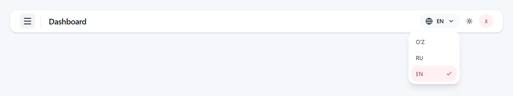

# Language selector redesign

Checkpoint: UIX.I18N.LANGUAGE_SELECTOR_REDÉSIGN — COMPLETE.

## Reference and scope

Reviewed the attached `codex-clipboard-331c64c8-faf1-45fe-941a-c757c373a40b.png` and the user's pasted redesign request. The image is the visual reference: muted rounded globe/code/chevron pill, right-aligned white rounded dropdown, vertical O‘Z/RU/EN options, pale red selected row and right-hand red check. Implemented those proportions using existing tokens and the existing Header's control height. No pixel-perfect claim: screenshots show the actual component at the requested viewport sizes, in an isolated local review fixture.

Only the selector's production implementation changed. Header, AuthShell, recovery surfaces, sibling spacing, theme/profile/navigation controls, dashboard filters/cards/charts, dependency manifests and localization runtime were untouched by this task. No sibling-spacing exception was necessary. No staging mutation, deployment, commit, reset, stash, revert or I18N.7 checkpoint was performed.

## Baseline

- Workspace: `D:\QR projects\qrhub-merchant-frontend`.
- Branch: `feature/dashboard-analytics`.
- HEAD: `b4d78b84fcb793ac3b99af2bb15180a6c07f6206`.
- The initial `git status --short` had 253 entries, including extensive modified tracked files and pre-existing untracked i18n sources/resources/reports. The complete status is preserved in [baseline-status.txt](language-selector-evidence/baseline-status.txt). This report describes incremental changes for this request, not all changes relative to HEAD.
- Prior I18N.6 evidence recorded 227 passing test files / 2,120 tests. This task adds one file / 13 tests. Existing localization tests and their assertions were retained and adapted where they depended on a native selector.

## Incremental files

| File | Change |
| --- | --- |
| `src/shared/i18n/LocaleSelect.tsx` | Pill and portalled Radix radio menu; presentation labels and duplicate-selection guard. |
| `src/shared/i18n/LocaleSelect.test.tsx` | 13 focused tests using real Radix and the existing locale runtime. |
| `src/app/shell-auth-account.i18n.test.tsx` | Native select interactions replaced with real menu selection; full locale names, draft/focus/error/storage assertions retained. Profile selectors now distinguish the separate language-menu trigger. Authenticated route/session/cache/read preservation also exercised through the selector. |
| `src/app/layout/Header.test.tsx` | Updated button/native-select counts while retaining all other Header assertions. |
| `src/app/layout/Header.profile-menu.test.tsx` | Extended its server-rendering Radix mock for radio items and attributed the extra button specifically to the language selector; profile/logout assertions retained. |
| `docs/i18n/LANGUAGE_SELECTOR_REDESIGN_REPORT.md` | This report. |
| `docs/i18n/language-selector-evidence/` | Baseline, check logs, browser measurements and screenshots. |

Temporary root-level review HTML/TSX files were removed and the local Vite process and review tabs were closed. Browser viewport overrides were reset.

## Implementation and accessibility

`LocaleSelect()` retains its existing public contract. A 36px pill contains Lucide globe and downward chevron icons around the canonical active locale's short visual label. A typed presentation map provides O‘Z/RU/EN; it is not an independent options list. Options still iterate only `supportedLocales`, with full native accessible names from `languageRegistry` and appropriate `lang` attributes.

The project already uses `radix-ui` DropdownMenu; this selector uses its Trigger, Portal, Content, RadioGroup, RadioItem and ItemIndicator. RadioGroup's controlled value is the existing runtime locale. No second locale state, custom navigation implementation or new dependency was introduced. Radix supplies menu semantics, arrow navigation, selected `aria-checked`, dismissal and trigger-focus restoration. The localized trigger name is accompanied by a unique description announcing the full selected language; existing polite switching status and localized alert are retained. Decorative icons are hidden from assistive technology.

The menu is 128px wide, end-aligned with a 6px offset, 12px viewport collision padding, available-width/height constraints and vertical scrolling. A portal prevents clipping by Header containers. Rows have consistent 40px minimum height and neutral hover/focus treatment. The selected row remains red while highlighted.

The active light-theme text uses the existing darker red `primary-hover` token on `brand-soft`; dark mode uses the existing lighter red `status-error-foreground` token on dark `brand-soft`. The check uses the brand red in light mode and the lighter red token in dark mode. Global tokens were not edited.

The selector skips the current locale and blocks additional selections during one pending request, without replacing the runtime's concurrency handling. A different enabled locale goes through the existing `switchLocale()` exactly once. Failed or rejected switches show guarded localized feedback rather than service/engine error details. The current locale, focus and persistence remain intact on failure. Uninitialized recovery selectors stay disabled.

## Existing i18n and state preservation

Registry, resources, language resolution precedence, storage key, root `html` lang/dir updates, guarded messages, fallback and critical policy are unchanged. No direct engine import was added to UI code. There are no network calls, reloads, auth commands, cache operations or route changes in the selector.

Focused integration tests preserve phone/OTP/PIN/set-PIN draft values, visibility, input identity and selector focus without auth dispatch or fetch. The actual authenticated route test now selects Russian through the new menu and verifies the same AuthContext/session, tokens/device storage, QueryClient cache, URL/history, lock count and unchanged profile-read request count. The broader localization suite continues to cover feature read/filter/form preservation. No locale-only backend refetch was detected in these synthetic integration checks.

## Verification results

All commands ran in the existing dirty workspace. Logs are retained in `language-selector-evidence`.

| Command | Result | Evidence |
| --- | --- | --- |
| `npm run locales:validate` | PASS: uz/ru/en, all 11 enabled namespaces. | [log](language-selector-evidence/locales-validate.txt) |
| `npm run lint` | PASS: import boundary and production-literal gates; two existing Fast Refresh warnings in `button.tsx` and `badge.tsx`. No new warning. | [log](language-selector-evidence/lint.txt) |
| `npm run typecheck` | PASS: catalog validation and TypeScript build. | [log](language-selector-evidence/typecheck.txt) |
| `npx vitest run src/shared/i18n/LocaleSelect.test.tsx src/app/shell-auth-account.i18n.test.tsx src/app/layout/Header.profile-menu.test.tsx src/app/layout/Header.test.tsx --maxWorkers=2` | PASS: 4 files, 59 tests; final run 5.18s. Includes 13 new selector tests. | [log](language-selector-evidence/focused-tests.txt) |
| `npm test` | PASS: 228 files, 2,133 tests; 66.02s. | [log](language-selector-evidence/full-tests.txt) |
| `npm run build` | PASS: validation, boundary/literal checks, TypeScript and Vite; Vite 1.37s. Existing >500kB chunk warning remains. | [log](language-selector-evidence/build.txt) |
| `git diff --check` | PASS, exit 0. Existing LF→CRLF Git notices remain; no whitespace errors. | [log](language-selector-evidence/diff-check.txt) |

An initial focused run caught outdated Header button-count assertions and test spies installed after the component had captured the service reference. Those tests were corrected without removing behavioral assertions; the final focused and full runs passed. The last adjustment darkened selected light-theme text; the focused run and build above were run after that presentation-only change.

## Browser verification

Used the Codex in-app browser with a local Vite fixture importing the actual shared Header, AuthShell/LoginForm and integration-unavailable component, plus the actual LocaleProvider/runtime and ThemeProvider. All action handlers were synthetic; no staging backend was used. This verifies component placement/interaction, not an authenticated staging session.

Checked closed pill, click-open menu, all enabled options, active English/Russian check, light/dark styles, keyboard open, Escape/focus restoration, outside-pointer dismissal, and menu-driven translation updates without navigation. A synthetic auth phone draft survived Russian→English selection. Automated integration tests additionally verify input identity and the preserved value.

The final matrix covers all three surfaces in both themes at 390×844 and 1280×800: 12 combinations. In every combination document scroll width equalled the requested viewport width, and the dropdown rectangle remained within viewport bounds. At mobile width the existing Header title uses its existing truncation while all controls remain visible. See [browser measurements](language-selector-evidence/browser-measurements.json) for exact rectangles and computed selected-row colors.

| Surface | 390px light | 390px dark | 1280px light | 1280px dark |
| --- | --- | --- | --- | --- |
| Header | [screenshot](language-selector-evidence/390-light-header-open.jpg) | [screenshot](language-selector-evidence/390-dark-header-open.jpg) | [screenshot](language-selector-evidence/1280-light-header-open.jpg) | [screenshot](language-selector-evidence/1280-dark-header-open.jpg) |
| AuthShell | [screenshot](language-selector-evidence/390-light-auth-open.jpg) | [screenshot](language-selector-evidence/390-dark-auth-open.jpg) | [screenshot](language-selector-evidence/1280-light-auth-open.jpg) | [screenshot](language-selector-evidence/1280-dark-auth-open.jpg) |
| Recovery | [screenshot](language-selector-evidence/390-light-recovery-open.jpg) | [screenshot](language-selector-evidence/390-dark-recovery-open.jpg) | [screenshot](language-selector-evidence/1280-light-recovery-open.jpg) | [screenshot](language-selector-evidence/1280-dark-recovery-open.jpg) |

Additional evidence: [closed pill](language-selector-evidence/desktop-light-closed.jpg), [outside dismissal](language-selector-evidence/desktop-light-outside-dismissed.jpg), [reference comparison crop](language-selector-evidence/selector-preview.jpg). The comparison crop excludes only the temporary fixture's review toolbar and blank page area; full context screenshots are retained above. Keyboard-open matrix screenshots show Radix's first-item focus highlight; the reference-comparison screenshot uses click opening so only the selected item is highlighted.

## Limits

No screen-reader session, pixel-diff against the attachment, or live staging authentication/mutation was performed. Accessibility is supported by actual Radix DOM semantics, focused interaction tests and browser focus verification. Responsive findings apply to the requested sizes and locally mounted existing surfaces. Existing lint/chunk/line-ending warnings are outside this selector-only task.
